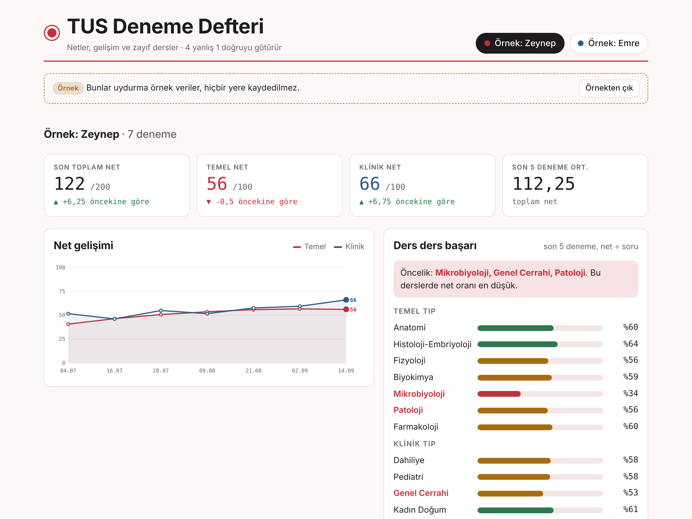
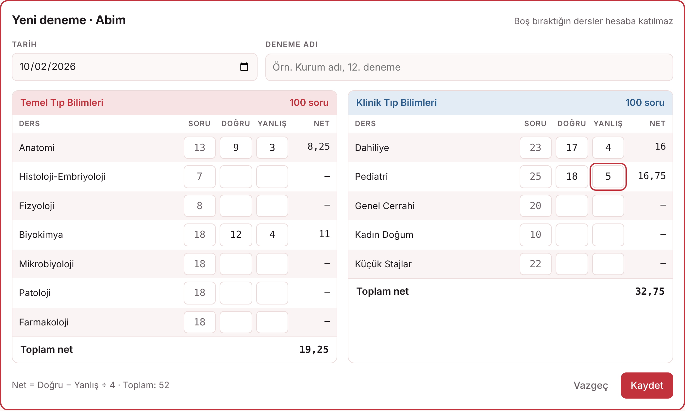
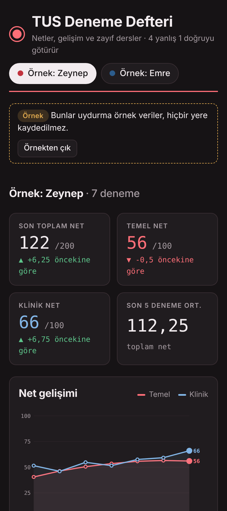

<p align="center">
  
</p>

<h1 align="center">TUS Deneme Defteri</h1>

<p align="center">
  TUS'a hazırlananlar için deneme takip uygulaması.<br>
  Ders ders net girişi, gelişim grafiği ve zayıf ders analizi.
</p>

<p align="center">
  <a href="https://mustafa-demir99.github.io/tus-deneme-defteri/"><b>Canlı demo</b></a>
</p>



## Özellikler

- **Ders ders net hesabı:** Temel Tıp (7 ders) ve Klinik Tıp (5 ders) için doğru/yanlış girişi. Net, ÖSYM kuralına göre hesaplanır (4 yanlış 1 doğruyu götürür).
- **Gelişim grafiği:** Temel ve Klinik netlerinin denemeden denemeye değişimi.
- **Zayıf ders analizi:** Son 5 denemeye göre her dersin başarı oranı; en düşük 3 ders "öncelik" olarak işaretlenir.
- **Birden fazla kişi:** Aynı uygulamada birden fazla kişi takip edilebilir, karşılaştırma tablosu otomatik oluşur.
- **Yedekleme:** Veriler JSON dosyası olarak indirilip başka bir cihaza yüklenebilir.
- **Açık ve koyu tema:** Cihazın temasına otomatik uyum sağlar, telefonda da rahat kullanılır.

## Ekran görüntüleri

| Deneme girişi | Telefon (koyu tema) |
|---|---|
|  |  |

## Kullanım

Kurulum gerekmez. [Canlı demoyu](https://mustafa-demir99.github.io/tus-deneme-defteri/) aç ya da projeyi indirip `index.html` dosyasını tarayıcıda çalıştır.

1. Üstteki kutuya adını yazıp **Ekle**'ye bas.
2. **Yeni deneme gir** ile her dersin doğru ve yanlış sayısını yaz.
3. Netler, grafik ve ders analizi kendiliğinden güncellenir.

> Veriler tarayıcının kendi hafızasında (localStorage) saklanır ve hiçbir sunucuya gönderilmez. Başka cihaza taşımak için **Yedek dosyası indir** düğmesini kullan.

## Proje yapısı

```
├── index.html      Sayfa yapısı
├── style.css       Tasarım (açık/koyu tema)
├── app.js          Uygulama mantığı, net hesabı, grafik
├── favicon.svg     Site ikonu
└── screenshots/    README görselleri
```

Hiçbir kütüphane veya framework kullanılmadı; düz HTML, CSS ve JavaScript.

## Notlar

Ders başına soru sayıları yaklaşık bir dağılımdır ve yayından yayına değişebilir. Bu yüzden formda her dersin soru sayısı değiştirilebilir.

## Lisans

[MIT](LICENSE) © 2026 Mustafa Demir
